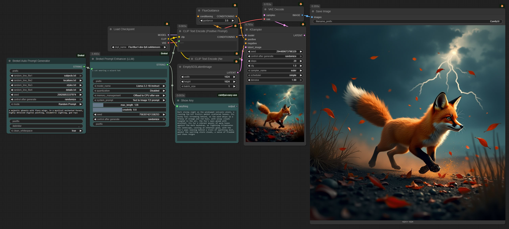
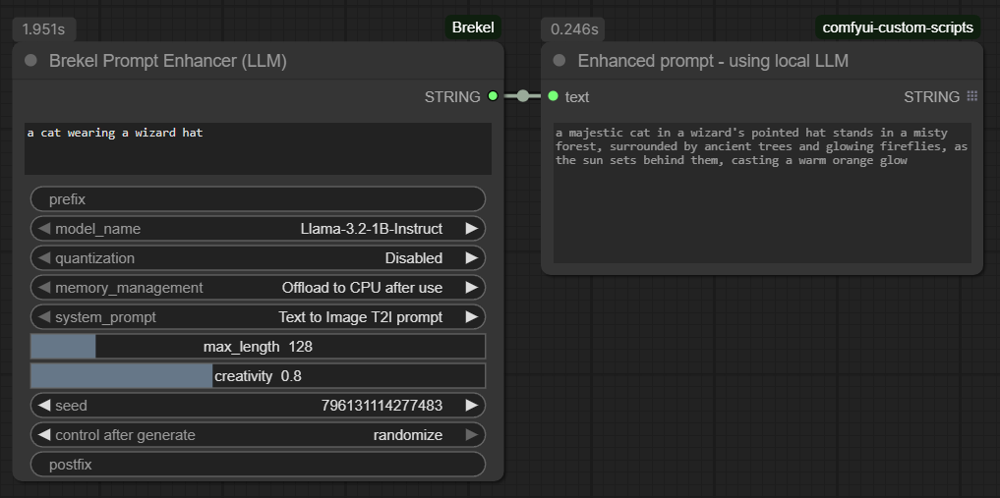
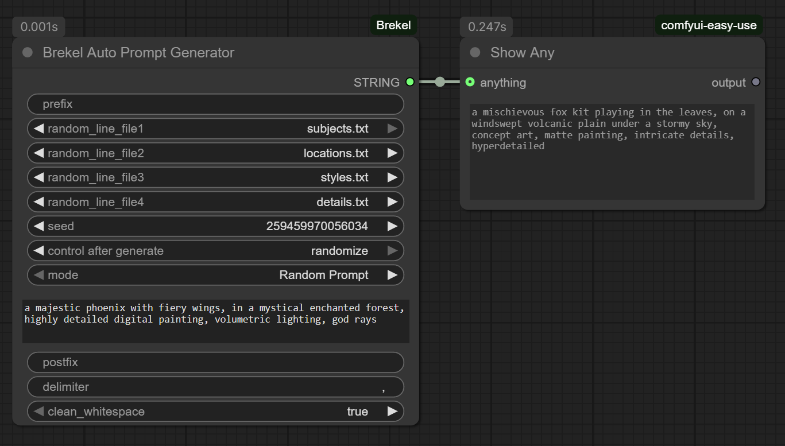
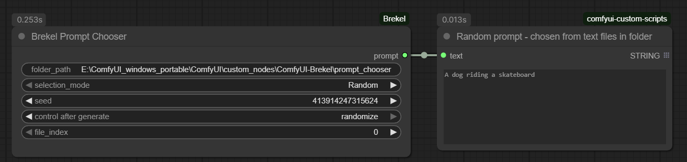

# Brekel's Custom Nodes for ComfyUI

A collection of custom nodes for ComfyUI designed to enhance and streamline your workflow.  
These nodes provide tools for generating, combining, enhancing, and selecting prompts dynamically, plus
utility nodes for resolutions, loading/saving images with extra metadata, and loading LoRAs from a folder.




## Table of Contents

- [📦 Installation](#-installation)
- 📖 Nodes Overview
  - [📃 Brekel Prompt Enhancer (LLM)](#-brekel-prompt-enhancer-llm)
  - [📃 Brekel Auto Prompt Generator](#-brekel-auto-prompt-generator)
  - [📃 Brekel Prompt Chooser](#-brekel-prompt-chooser)
  - [📐 Brekel Resolution Selector](#-brekel-resolution-selector)
  - [🖼️ Brekel Load Image (with Filename & Caption)](#️-brekel-load-image-with-filename--caption)
  - [💾 Brekel Save Image (PNG/JPG)](#-brekel-save-image-pngjpg)
  - [🎛️ Brekel Lora Loader (Directory)](#️-brekel-lora-loader-directory)
- [📝 Author](#-author)
## 


## 📦 Installation

#### Recommended: ComfyUI Manager

1. Open the **ComfyUI Manager**.
2. Click on **Install Custom Nodes**.
3. Search for `Brekel` or the name of one of the nodes.
4. Click **Install** on the desired node pack.
5. Restart ComfyUI. 

The manager will automatically handle the installation and download any required dependencies for the `Prompt Enhancer (LLM)` node.

#### 

#### Manual Installation (Git)

1. Navigate to your ComfyUI custom nodes directory:
   
   ```bash
   cd ComfyUI/custom_nodes/
   ```
2. Clone this repository:
   
   ```bash
   git clone https://github.com/brekel/ComfyUI-Brekel.git
   ```
3. Install the required Python packages for the `Prompt Enhancer (LLM)` node:
   
   ```bash
   cd ComfyUI-Brekel
   pip install -r requirements.txt
   ```
4. Restart ComfyUI.

The other nodes have no dependencies beyond what ComfyUI already ships with.
## 


### 📃 Brekel Prompt Enhancer (LLM)

This node uses a local Large Language Model (LLM) to creatively rewrite and enhance a simple input prompt into a more detailed and descriptive one.  
No need for 3rd party apps or cloud API calls, all from within ComfyUI


#### Setup Requirements
**LLM Models**: This node uses LLM models from the `ComfyUI/models/LLM/` directory.  
The node expects models in the standard Hugging Face format (i.e., the folder should contain `config.json`, `model.safetensors`, etc.).

**Some LLM model suggestions**:
| Model name / link                                                                            | Model Size |
|:---------------------------------------------------------------------------------------------|:-----------|
| [Llama-3.2-1B-Instruct](https://huggingface.co/meta-llama/Llama-3.2-1B-Instruct)             | 1B         |
| [Llama-3.2-3B-Instruct](https://huggingface.co/meta-llama/Llama-3.2-3B-Instruct)             | 3B         |
| [Llama-3.1-8B-Uncensored](https://huggingface.co/Orenguteng/Llama-3.1-8B-Lexi-Uncensored-V2) | 8B         |
| [Qwen2-0.5B-Instruct](https://huggingface.co/Qwen/Qwen2-0.5B-Instruct)                       | 0.5B       |
| [Qwen2-1.5B-Instruct](https://huggingface.co/Qwen/Qwen2.5-1.5B-Instruct)                     | 1.5B       |

**To install a model**:
- Open a command prompt in the `ComfyUI/models/LLM/` directory.
- On the HuggingFace page click the three dots icon (just left to the Train button) and select `Clone Repository`.
- Copy the command that starts with: `git clone https://.......`
- Paste and execute this command in your command prompt.
- You may need to run the `git lfs install` first to install Large File Support.
- Some models (like Llama) may need you to request access first from the `Model card` page, approval make take while


**System Prompts**: The node reads "system prompts" (instructions for the LLM) from `.txt` files located in `ComfyUI/custom_nodes/ComfyUI-Brekel/prompt_enhancer/`.  
This folder is included with the installation and contains default system prompts for text-to-image and text-to-video. You can edit these or add your own `.txt` files to create custom LLM behaviors. (the node will automatically add a line to the prompt to ask the LLM to respect the `max_length`)

#### Inputs

| Parameter           | Type     | Description                                                                                                                                     |
|:------------------- |:-------- |:----------------------------------------------------------------------------------------------------------------------------------------------- |
| `prompt`            | STRING   | The simple, original prompt you want to enhance.                                                                                                |
| `prefix`            | STRING   | Prefix to prepend at the start of the prompt, for example to add your Lora trigger word(s).                                                     |
| `model_name`        | Dropdown | The LLM to use. The list is populated from your `ComfyUI/models/LLM/` folder.                                                                   |
| `quantization`      | Dropdown | VRAM saving technique. `16-bit` is highest quality, while `8-bit` and `4-bit` use significantly less VRAM at a slight cost to precision.        |
| `memory_management` | Dropdown | How to handle the model after use: `Keep in VRAM` (fastest for re-runs), `Offload to CPU` (saves VRAM), `Unload completely` (frees all memory). |
| `system_prompt`     | Dropdown | The instruction template for the LLM, loaded from the `prompt_enhancer` folder.                                                                 |
| `max_length`        | INT      | The maximum number of new tokens (words/characters) the LLM can generate.                                                                       |
| `creativity`        | FLOAT    | Controls the LLM's temperature. `0.0` is deterministic, while higher values (e.g., `0.8`) produce more creative and varied outputs.             |
| `seed`              | INT      | The seed for the LLM's random generation process. `0` means random.                                                                             |
| `postfix`           | STRING   | Postfix to append at the end of the prompt, for example to add your Lora trigger word(s).                                                       |
<br>


### 📃 Brekel Auto Prompt Generator

This node constructs a complete prompt by combining up to four randomly selected lines from different text files with a optional prefix/postfix.
It's a powerful tool for creating complex, semi-randomized prompts while still allowing full control by customizing the text file contents.


#### How to Use

1. This node reads from `.txt` files located in the `ComfyUI/custom_nodes/ComfyUI-Brekel/auto_prompt_generator/` folder, which is included with the installation.
2. Populate this folder with your own `.txt` files or edit the existing examples. Each file should contain a list of items, one per line (e.g., a file for styles, another for artists, another for lighting types). You can of course add additional text files. (Refresn Node Definitions to update the node with new text file entries)
3. In ComfyUI, use the `random_line_file` dropdowns to select the files you want to draw from. Selecting "None" will skip that slot.
4. The node will pick one random line from each selected file and combine them with your `prefix` and `postfix` using the specified `delimiter`.
5. Alternatively, set `use_static_prompt` to "true" to bypass the random generation and use the text from the `static_prompt` input instead.

#### Inputs

| Parameter             | Type     | Description                                                                                                      |
|:--------------------- |:-------- |:---------------------------------------------------------------------------------------------------------------- |
| `prefix`              | STRING   | Text that will always appear at the beginning of the prompt.                                                     |
| `random_line_file1-4` | Dropdown | Select a `.txt` file from the `auto_prompt_generator` folder. The node will pick one random line from this file. |
| `seed`                | INT      | The seed used for choosing the random lines from the files.                                                      |
| `mode`                | Dropdown | `Random Prompt`: Selects random lines from the files. `Static Prompt`: Uses the `use_static_prompt`.             |
| `static_prompt`       | STRING   | A fixed prompt to use when `mode` is set to `Static Prompt`.                                                     |
| `postfix`             | STRING   | Text that will always appear at the end of the prompt.                                                           |
| `delimiter`           | STRING   | The character(s) used to join the different prompt parts (e.g., ", " or "\n" for a newline).                     |
| `clean_whitespace`    | Dropdown | `true`: Removes any leading/trailing whitespace from the final prompt.                                           |
<br>


### 📃 Brekel Prompt Chooser

This node allows you to select a text prompt from a folder of `.txt` files, either randomly or by a specific index.  
It's perfect for workflows where you want to iterate through a predefined list prompts.


#### How to Use

1. This node uses the `ComfyUI/custom_nodes/ComfyUI-Brekel/prompt_chooser/` folder, which is included with the installation.
2. Place your `.txt` files inside this folder. Each file should contain a single prompt.
   * Example: `cat.txt` could contain "A cat wearing a wizard hat".
   * Example: `dog.txt` could contain "A dog riding a skateboard".
   * Add as many of your own files and/or delete the example files as needed.
3. In ComfyUI, set the `folder_path` to this directory (it should be the default).
4. Choose your `selection_mode`:
   * **Random**: Uses the `seed` to pick a random file. A seed of 0 will be different each time.
   * **Index**: Picks a file based on its alphabetical order in the folder. The index will wrap around if it's larger than the number of files.

#### Inputs

| Parameter        | Type     | Description                                                                                                   |
|:---------------- |:-------- |:------------------------------------------------------------------------------------------------------------- |
| `folder_path`    | STRING   | The full path to the folder containing your `.txt` prompt files.                                              |
| `selection_mode` | Dropdown | `Random`: Selects a file randomly based on the seed. `Index`: Selects a specific file by its numerical index. |
| `seed`           | INT      | The seed for the random number generator when in `Random` mode.                                               |
| `file_index`     | INT      | The index of the file to choose (alphabetically sorted) when in `Index` mode.                                 |
<br>


### 📐 Brekel Resolution Selector

A simple dropdown with common resolution presets, so width, height and the number of frames are set in
one place and can be re-used throughout your workflow.

#### How to Use

1. Pick a preset from the `resolution` dropdown, presets are included for Flux/Qwen, SDXL, SD 1.5 and video (480p / 540p / 720p / 1080p).
2. Use `orientation` to flip a preset between landscape and portrait, width and height are swapped when needed (square presets are unaffected).
3. Connect `width` and `height` to your latent / empty image node, and `num_frames` to your video node.
4. `num_frames` steps in increments of 4 with a default of 121, which keeps it WAN compliant (4n+1).

#### Inputs

| Parameter     | Type     | Description                                                                              |
|:------------- |:-------- |:---------------------------------------------------------------------------------------- |
| `resolution`  | Dropdown | The resolution preset to use, grouped by model family (Flux/Qwen, SDXL, SD 1.5, Video). |
| `orientation` | Dropdown | `Landscape` or `Portrait`, swaps width and height when the preset does not match.        |
| `num_frames`  | INT      | Number of frames to generate, primarily for video workflows.                              |

#### Outputs

| Output       | Type | Description                                          |
|:------------ |:---- |:---------------------------------------------------- |
| `width`      | INT  | The width of the selected preset after orientation.  |
| `height`     | INT  | The height of the selected preset after orientation. |
| `num_frames` | INT  | The number of frames, passed through unchanged.      |
<br>


### 🖼️ Brekel Load Image (with Filename & Caption)

The same as the standard Load Image node, but with two extra outputs: the filename and the caption
embedded in the image.

#### How to Use

- Connect `filename` to the `filename_prefix` of a save node to keep the source name of your images
  through an img2img or upscale workflow, or use it anywhere else a string is accepted.
- Connect `caption` to a text encoder or prompt input to re-use the caption that was stored in the image,
  it stays empty when the image has none.
- The caption is read from the PNG text chunks (`parameters`, `Description`, `caption`) and from the
  JPG/WEBP EXIF fields (`UserComment`, `ImageDescription`), which is what the
  [Brekel Save Image](#-brekel-save-image-pngjpg) node and most other tools write.
  The workflow/prompt metadata of a regular ComfyUI image is deliberately ignored, that is not a caption.

#### Inputs

| Parameter | Type     | Description                                                          |
|:--------- |:-------- |:-------------------------------------------------------------------- |
| `image`   | Dropdown | The image to load from the ComfyUI input folder, with upload button. |

#### Outputs

| Output     | Type   | Description                                                  |
|:---------- |:------ |:------------------------------------------------------------ |
| `image`    | IMAGE  | The loaded image.                                            |
| `mask`     | MASK   | The alpha channel as a mask, like the standard node.         |
| `filename` | STRING | The name of the file without its extension.                  |
| `caption`  | STRING | The caption embedded in the image, empty when there is none. |
<br>


### 💾 Brekel Save Image (PNG/JPG)

Like the standard Save Image node, but with control over the file format, the numbering and the
embedded metadata.

#### Key Features

- Save as **PNG or JPG**, with a quality setting for JPG.
- A **save toggle** that turns the node into a preview node, the images go to the temp folder and the
  output folder and its numbering are left untouched.
- **`start_number`** sets the first number used, so a sequence can start at any offset.
- **`fill_gaps`** scans the output folder and re-uses missing numbers, so deleting `image_00003_` while
  `image_00004_` exists makes the next save land on `_00003_` again, keeping the range continuous.
- Numbering is **shared between PNG and JPG** (and existing WEBP files), so the two formats never claim
  the same number.
- By default the **workflow/prompt is embedded** (drag & drop the PNG onto the canvas to restore it),
  connecting the optional `caption` input embeds that text instead. In a JPG the metadata goes into
  EXIF, and is dropped rather than failing the save when a large workflow does not fit the 64KB limit.
- Outputs the images and the `filename` that was written, so it can be chained into other nodes.

#### Inputs

| Parameter         | Type     | Description                                                                                                                |
|:----------------- |:-------- |:-------------------------------------------------------------------------------------------------------------------------- |
| `images`          | IMAGE    | The images to save.                                                                                                        |
| `save`            | BOOLEAN  | `save` writes to the output folder, `preview only` acts like a Preview Image node and leaves the output folder untouched.  |
| `filename_prefix` | STRING   | The prefix for the file to save, supports the usual formatting such as `%date:yyyy-MM-dd%` or `%Empty Latent Image.width%`. |
| `file_format`     | Dropdown | `png` is lossless and can be dragged onto the canvas to restore the workflow, `jpg` is smaller and stores metadata in EXIF. |
| `quality`         | INT      | JPG quality (1-100), ignored when saving PNG.                                                                              |
| `start_number`    | INT      | The first number of the sequence, numbers below this are never used.                                                       |
| `fill_gaps`       | BOOLEAN  | Re-use missing numbers in the sequence on disk instead of always appending after the highest one.                          |
| `caption`         | STRING   | Optional, when connected this text is embedded into the image instead of the workflow/prompt.                              |

#### Outputs

| Output     | Type   | Description                                               |
|:---------- |:------ |:--------------------------------------------------------- |
| `images`   | IMAGE  | The input images, passed through.                         |
| `filename` | STRING | The name of the last file written, without its extension. |
<br>


### 🎛️ Brekel Lora Loader (Directory)

Loads a LoRA from any folder on disk by **index** instead of picking it from the standard dropdown.
Because the index is a number widget it gets the `fixed / increment / decrement / randomize` control,
so a batch of queued runs can step through or randomly pick the LoRAs in a folder.

#### How to Use

1. Set `folder_path` to the folder holding your LoRAs (leave it empty to use the default ComfyUI `loras` folder).
2. Files (`.safetensors`, `.ckpt`, `.pt`) are sorted alphabetically, `lora_index` picks one and wraps around when it is larger than the number of files.
3. Set the control below `lora_index` to `increment` or `randomize` to walk through the folder over multiple runs.
4. Connect `LORA_NAME` to a save node's `filename_prefix` or a text input to record which LoRA was used.
5. Setting both strengths to `0` skips loading entirely and passes the model and clip through unchanged.

#### Inputs

| Parameter        | Type   | Description                                                                                           |
|:---------------- |:------ |:------------------------------------------------------------------------------------------------------ |
| `model`          | MODEL  | The model to apply the LoRA to.                                                                       |
| `clip`           | CLIP   | The CLIP to apply the LoRA to.                                                                        |
| `folder_path`    | STRING | Folder to load the LoRAs from, empty falls back to the default ComfyUI `loras` folder.                |
| `lora_index`     | INT    | Index of the LoRA in the alphabetically sorted folder, wraps around. Has the increment/randomize control. |
| `strength_model` | FLOAT  | How strongly to apply the LoRA to the model.                                                          |
| `strength_clip`  | FLOAT  | How strongly to apply the LoRA to the CLIP.                                                           |

#### Outputs

| Output      | Type   | Description                                                                        |
|:----------- |:------ |:----------------------------------------------------------------------------------- |
| `MODEL`     | MODEL  | The model with the LoRA applied.                                                   |
| `CLIP`      | CLIP   | The CLIP with the LoRA applied.                                                    |
| `LORA_NAME` | STRING | The name of the loaded LoRA without its extension, `None` when nothing was loaded. |
<br>


## 📝 Author

These nodes were created by **Brekel**.
- **Website**: [https://brekel.com](https://brekel.com)
